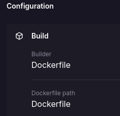

# Hello world whit rust
## Results
<p align="center">
    
</p>

Web application that deploys a web server and builds a simple API with a route that displays the message **Hello, world from Rust!**

## :open_book: How to use
### Pre-requisites
* rust language
* code editor
---

* Clone the repository
    ```
    git clone https://github.com/Pablo-man/rs_docker_project.git
    ```
* Open the program with the code editor of your choice
* Open a terminal that points to the root of the project
* Run the commands:

    ```
    cargo clean

    cargo build --release

    ./target/release/rust 
    ```
* Visit your `localhost:9000` to view the results

    > [!TIP]
    > By default the application will be deployed on port `9000`, if it is necessary to change it to another one you must modify it from the `src/main.rs` file and in the `bind("0.0.0.0:<PORT>>")` section place the desired port

## :rocket: How to run with docker
Visit the following link to learn about the process of generating the project image

:whale2: [GO](https://hub.docker.com/repository/docker/pamendeza/rs_docker_project "Docker steps")

## :light_rail: PAAS Deploy(Railway)
For its deployment in a PAAS we will rely on railway and its easy implementation thanks to its container management. 


The platform automatically uses our Dockerfile to build the container. 



> [!IMPORTANT]
> The application is automatically deployed on port 9000


:nut_and_bolt:[Hello World](https://rsdockerproject-production.up.railway.app "click for visit")